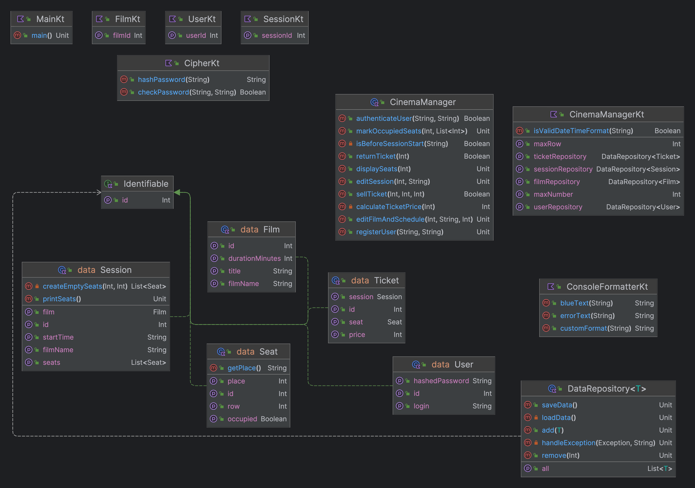
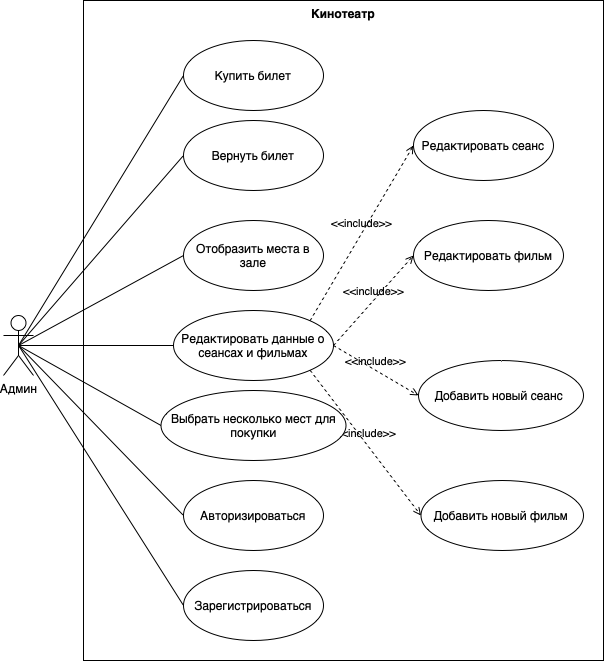

# Приложение для работников кинотеатра
## Мананкова Юлия БПИ226
#### Данное консольное приложение на Kotlin позволяет сотруднику кинотеатра (с единственным зрительным залом) управлять данными о фильмах,находящихся в прокате, и расписании сеансов их показа, продавать, осуществлять возврат билетов и отмечать посетителей сеансов

В программе пользователь может выполнить следующие действия:

1. Купить билет
2. Вернуть билет
3. Отобразить места в зале
4. Редактировать/добавить фильм или сеанс: \
    а. Редактировать существующий сеанс \
    б. Редактировать существующий фильм \
    в. Добавить новый сеанс \
    г. Добавить новый фильм 
5. Выбрать несколько мест для покупки
6. Авторизироваться
7. Зарегистрироваться
8. Выйти

Все данные о фильмах, сеансах, купленных билетах и зарегистрированных пользователях хранятся в папке data.
Для хранения данных выбран формат json, так как с ним удобнее всего работать на Kotlin.

Диаграмма классов:

Диаграмма прецедентов:

